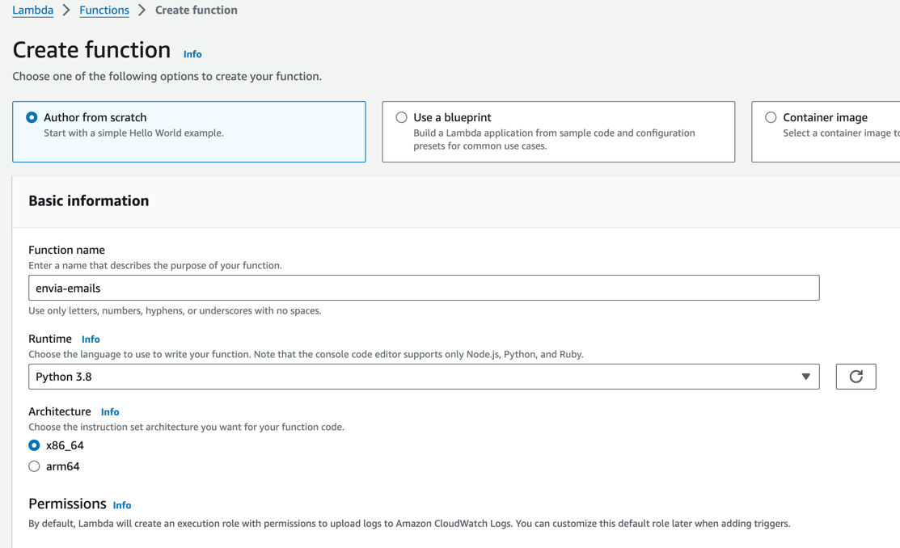
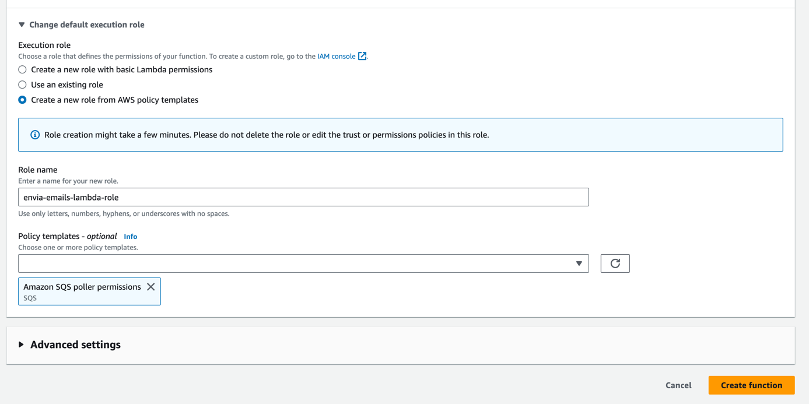
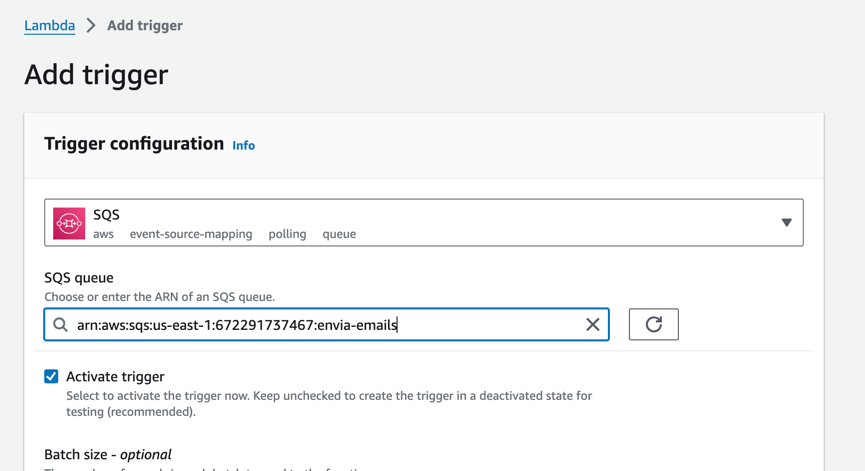
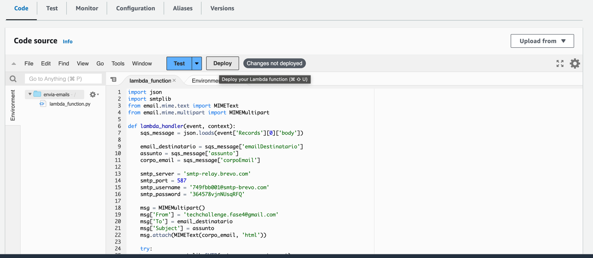
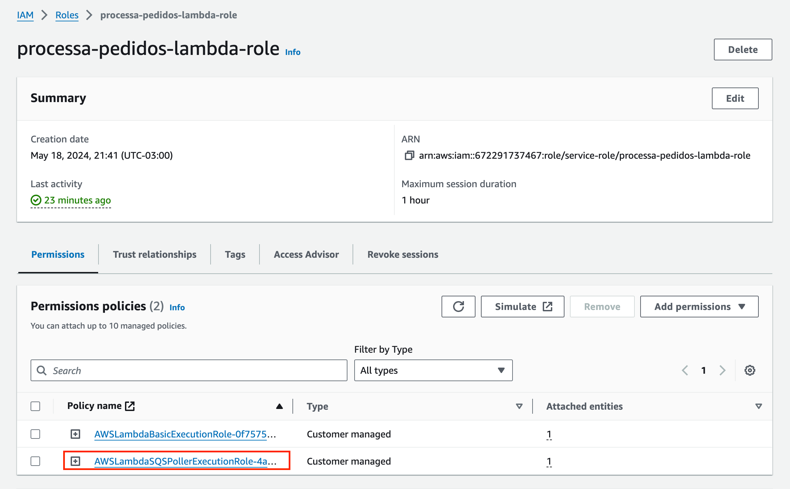
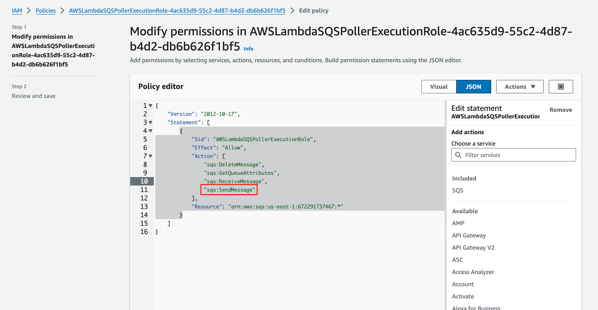

# processa-pedidos-app

Para criar a lambda na AWS siga os passos abaixo.

1 - Acesse o console e procure por AWS Lambda. Clique em Criar Lambda. Preencha as informações necessárias conforme passo a passo abaixo:

**Functiona name:** processa-pedidos

**Runtime:** Python 3.8

Clique em **Change default execution role** e selecione a opção **Create a new role from AWS policy templates**

**Role name:** processa-pedidos-lambda-role

Em policy templates procure por SQS e adicione o **poller permissions**, isso fará com que a lambda tenha permissão para acessar a fila SQS.

2 - Adicione um trigger, que será a fila SQS

3 - Cole o código da lambda na aba **Code** e clique em **Deploy**

4 - Depois vá ate o AWS IAM, menu Roles, e procure pela role **processa-pedidos-lambda-role** e clique em **AWSLambdaSQSPollerExecutionRole**

5 - Nessa nova tela clique em **Edit** e adicione a opção **"sqs:SendMessage"** em **Action**. Após isso salve as mundanças
